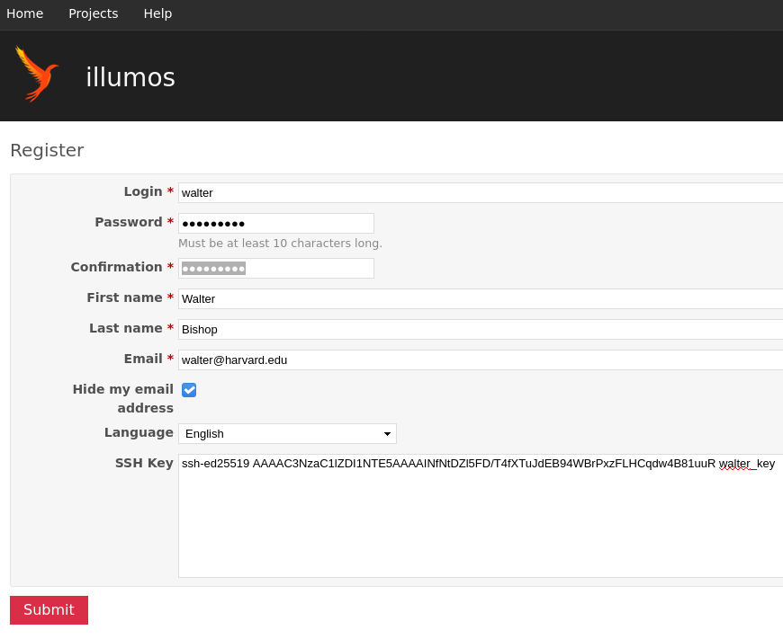
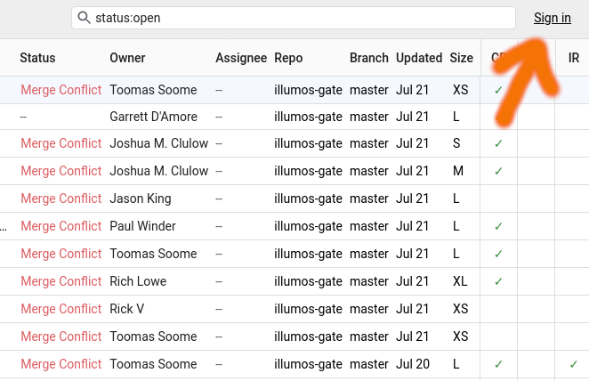
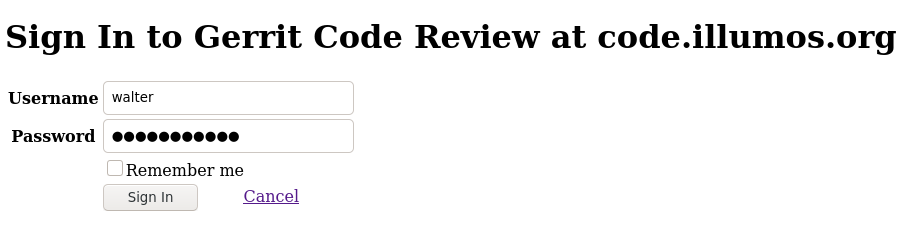
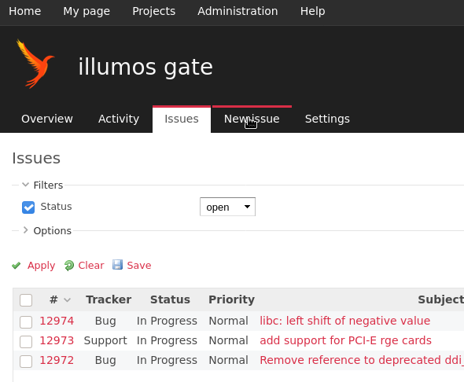
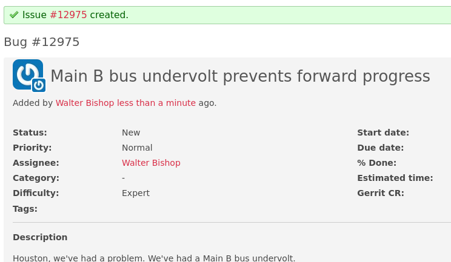
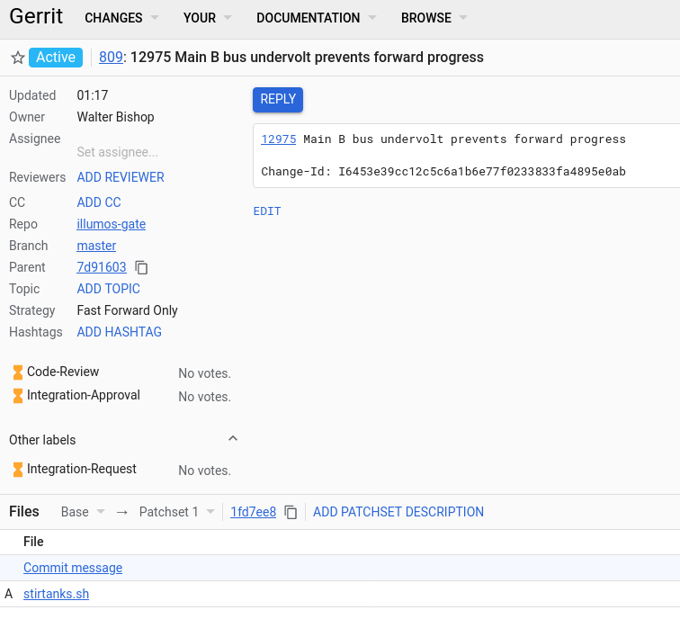
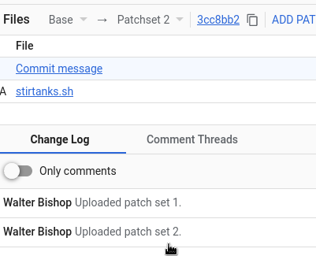
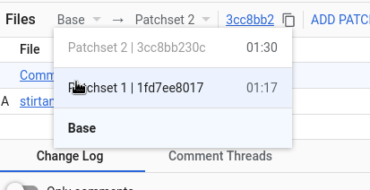
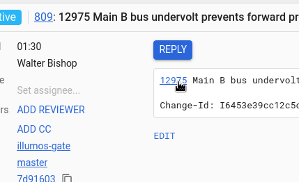
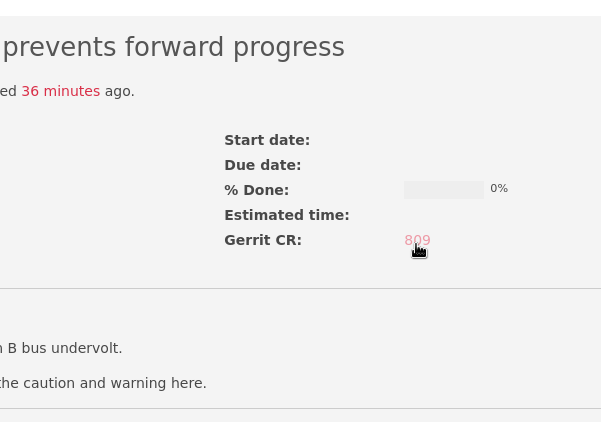

# Code Review with Gerrit

The illumos project provides a central service where you can upload changes for
review, using the same [Gerrit Code Review](https://www.gerritcodereview.com/)
software used by popular projects like Go and Android.

## Authentication

Gerrit uses the same accounts as the illumos project bug tracker.  The first
step to using Gerrit is to ensure that you have an account!

To register, navigate to: https://www.illumos.org/account/register

Pick a username and password, and provide your SSH key which we'll use when
pushing patches to Gerrit later.  You'll get an e-mail that you'll need to use
to confirm your account and then you can log in!



## Gerrit Web Interface

Once you have an account in the bug tracker, navigate to Gerrit:
https://code.illumos.org

Before you log in, the default front page lists changes that are currently
under review.  Click **Sign&nbsp;In** in the top right:



Enter the same username and password as you use for the bug tracker:



Now that you are logged in, you'll be taken to the dashboard of changes that
are directly relevant to you: those you have posted, or are reviewing.
Because you are a new user, you won't have any yet!

If you'd like to change any preferences, like selecting your preferred diff
view, or whether you want the dark or the light theme, click the gear wheel at
the top right next to your name and you'll be taken to the preferences page.

Because you added an SSH key when you created your bug tracker account, you
should be able to use that key to get access to Gerrit via SSH!  Let's check:

```
$ ssh walter@code.illumos.org

  ****    Welcome to Gerrit Code Review    ****

  Hi Walter Bishop, you have successfully connected over SSH.
...
```

If you get an authentication or key error, make sure your SSH agent is
correctly configured, and that the key is correctly entered into the site.  You
can always ask for help [in IRC or on the mailing list](../../community/) if
you're having trouble!

## Basic Workflow

Gerrit focuses on making a single well-formed commit as the basic unit of
change, which mirrors the way we work and [accept
contributions](../#submitting-a-patch) in the illumos project.  We generally
expect that a bug or feature in the bug tracker will have one associated
commit in the repository.

### 1. File a Bug

Let's make sure we have a bug filed for our work, which we will use in the
commit message to tie everything together.

Navigate to the bug tracker: https://bugs.illumos.org

Make sure you are logged in and click **New&nbsp;Issue**:



Fill out your bug and assign it to yourself:


We now have a bug number to work against!



### 2. Clone the software and install the hook script

Most of the time, people will clone the illumos repository from GitHub; e.g.,

```
$ git clone https://github.com/illumos/illumos-gate.git ~/illumos
$ cd ~/illumos
```

In order to interact with Gerrit, you'll need to add another [git
remote](https://git-scm.com/book/en/v2/Git-Basics-Working-with-Remotes):

```
$ git remote add illumos walter@code.illumos.org:illumos-gate.git
$ git remote -v
illumos walter@code.illumos.org:illumos-gate.git (fetch)
illumos walter@code.illumos.org:illumos-gate.git (push)
origin  https://github.com/illumos/illumos-gate.git (fetch)
origin  https://github.com/illumos/illumos-gate.git (push)
```

Gerrit uses a special `Change-Id:` footer in the commit message of your
change to track new versions of your change.  The easiest way to ensure
you have the footer is to install the hook script that Gerrit supplies:

```
$ cd ~/illumos
$ scp -p -P 29418 walter@code.illumos.org:hooks/commit-msg .git/hooks/
```

You'll make your change in your local clone.  It is generally easiest to start
with a local branch; e.g.,

```
$ cd ~/illumos
$ git checkout -b my-change
Switched to a new branch 'my-change'
```

Now, whenever you `git commit`, a `Change-Id:` footer will be added to your
message by the hook script it does not already have one.  For example:

```
$ git add stirtanks.sh
$ git commit -m '12975 Main B bus undervolt prevents forward progress'
[master ba979ab7bd] 12975 Main B bus undervolt prevents forward progress
 1 file changed, 0 insertions(+), 0 deletions(-)
 create mode 100644 stirtanks.sh
$ git show
commit ba979ab7bd4e254e73b7539530e30f7d232bcfa1
Author: Walter Bishop <walter@harvard.edu>
Date:   Wed Jul 22 01:01:44 2020 -0700

    12975 Main B bus undervolt prevents forward progress

    Change-Id: I6453e39cc12c5c6a1b6e77f0233833fa4895e0ab

diff --git a/stirtanks.sh b/stirtanks.sh
...
```

You can start with as many commits in your branch as you like while you're
working, but when you submit to Gerrit they need to be "squashed" down into one
commit.  The Git book has a good chapter on [rewriting
history](https://git-scm.com/book/en/v2/Git-Tools-Rewriting-History) that has a
lot more detail on how to squash commits.  You can also just work with a single
commit yourself and use `git commit --amend` each time you want to add to it.

### 3. Prepare your commit and push to Gerrit

When you're happy with your change and you'd like to get review, you're ready
to push it to Gerrit!  It's always good to make sure your outgoing commit is
exactly as you intend, with the bug number and synopsis matching what you put
in the bug tracker:

```
$ git log --decorate --graph
* commit 4741cbf8499c763f75e48ae302c990e1f58c2381 (HEAD -> my-change)
| Author: Walter Bishop <walter@illumos.org>
| Date:   Wed Jul 22 01:05:27 2020 -0700
|
|     12975 Main B bus undervolt prevents forward progress
|
|     Change-Id: I6453e39cc12c5c6a1b6e77f0233833fa4895e0ab
|
* commit 7d91603476b740ff8f4c917d71ee5884ab39cb60 (origin/master, origin/HEAD)
| Author: Robert Mustacchi <rm@fingolfin.org>
| Date:   Thu Jul 9 18:33:59 2020 -0700
|
|     12966 imc driver blew up on missing channel
|     Reviewed by: Andy Fiddaman <andy@omniosce.org>
|     Reviewed by: Igor Kozhukhov <igor@dilos.org>
|     Reviewed by: Paul Winder <paul@winder.uk.net>
|     Approved by: Dan McDonald <danmcd@joyent.com>
...
```

To push, we use a special syntax that tells Gerrit this is a change for review:

```
$ git push illumos HEAD:refs/for/master
Enumerating objects: 4, done.
Counting objects: 100% (4/4), done.
Delta compression using up to 8 threads
Compressing objects: 100% (2/2), done.
Writing objects: 100% (3/3), 377 bytes | 188.00 KiB/s, done.
Total 3 (delta 1), reused 0 (delta 0)
remote: Resolving deltas: 100% (1/1)
remote: Counting objects: 81707, done
remote: Processing changes: refs: 1, new: 1, done
remote:
remote: SUCCESS
remote:
remote:   https://code.illumos.org/c/illumos-gate/+/809 12975 Main B bus undervolt prevents forward progress [NEW]
remote:
To code.illumos.org:illumos-gate.git
 * [new branch]            HEAD -> refs/for/master
```

Success!  In the output, we can see the URL of the new change that Gerrit has
created for us.  You can navigate there to see what it looks like on the web:



Once you see your change correctly uploaded, it's time to seek review from
interested parties -- generally via the illumos developer mailing list, or in
IRC.  As people review your change, you will receive e-mail notifications with
their feedback or their +1 votes.  You can also see their comments in the web
interface, which is particularly helpful when a contributor has left feedback
on a particular line or set of lines in your change.

### 4. Update your change with new contents

During the course of review, other contributors may leave feedback on areas
that could use improvement; e.g., a comment that describes your design.  Once
you've addressed the feedback, you can update your existing change in Gerrit.

Recall that Gerrit works in a unit of a single commit.  As before, your
changes must be squashed (e.g., using `git rebase -i`) or amended
(e.g., using `git commit --amend`) so that they appear as a single commit.
The easiest way is generally just to edit your files, add them, and amend
your existing commit:

```
$ cd ~/illumos
$ vim stirtanks.sh
$ git add stirtanks.sh
$ git commit --amend
[my-change 3cc8bb230c] 12975 Main B bus undervolt prevents forward progress
 Date: Wed Jul 22 01:17:07 2020 -0700
 1 file changed, 6 insertions(+)
 create mode 100755 stirtanks.sh
```

It is very important that you do not alter the `Change-Id:` footer while using
`git commit --amend`.  This footer is how Gerrit detects that you are updating
an existing commit instead of starting a totally separate change.  Assuming the
`Change-Id:` is still intact, you can just push as you did before:

```
$ git push illumos HEAD:refs/for/master
Enumerating objects: 4, done.
Counting objects: 100% (4/4), done.
Delta compression using up to 8 threads
Compressing objects: 100% (2/2), done.
Writing objects: 100% (3/3), 391 bytes | 195.00 KiB/s, done.
Total 3 (delta 1), reused 0 (delta 0)
remote: Resolving deltas: 100% (1/1)
remote: Counting objects: 81700, done
remote: Processing changes: refs: 1, updated: 1, done
remote:
remote: SUCCESS
remote:
remote:   https://code.illumos.org/c/illumos-gate/+/809 12975 Main B bus undervolt prevents forward progress
remote:
To code.illumos.org:illumos-gate.git
 * [new branch]            HEAD -> refs/for/master
```

You can see that we got the same URL as last time because Gerrit recognised our
Change ID and updated our existing change.  You can see a second patch set in
the Gerrit web interface:



Note that when you upload new versions of a commit, the old versions are
still there.  This enables reviewers (and you!) to see the progress you've
made as you incrementally improve your change.  You can see the delta between
and old and a new version easily in the web interface:



Assuming your commit message starts with the bug number as in the example
above, the system will automatically link between the commit message in
Gerrit and the bug tracker, making navigation a bit easier:



The system will also link the bug back to the open Gerrit change:




### 5. Interact with Gerrit using more advanced Git tools

In addition to the web interface, Gerrit offers rich remote access using
regular Git commands.  This can be very handy when reviewing and testing large
changes, or when needing to clone and build a Gerrit patchset on another
system.  With `git ls-remote`, you can see both of the patchsets we uploaded
earlier (1 and 2):

```
$ git ls-remote illumos | grep -w 809
1fd7ee801782e3bb6dc07f91f236944dc062ac30        refs/changes/09/809/1
3cc8bb230cd30371d48e0bc7c928498e8a733483        refs/changes/09/809/2
f5d33aea8fda859cac5d6694a3b250c8b1c70ae7        refs/changes/09/809/meta
```

You can also fetch them into a local clone and inspect the commit:

```
$ git fetch illumos refs/changes/09/809/1
From code.illumos.org:illumos-gate
 * branch                  refs/changes/09/809/1 -> FETCH_HEAD

$ git show FETCH_HEAD | cat
commit 1fd7ee801782e3bb6dc07f91f236944dc062ac30
Author: Walter Bishop <walter@illumos.org>
Date:   Wed Jul 22 01:17:07 2020 -0700

    12975 Main B bus undervolt prevents forward progress

    Change-Id: I6453e39cc12c5c6a1b6e77f0233833fa4895e0ab

diff --git a/stirtanks.sh b/stirtanks.sh
new file mode 100755
...
```
